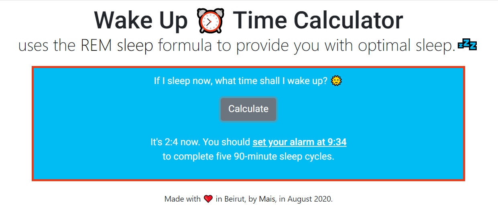

# flight-status
Created on the National Aviation Day of the US, Flight Status returns the status of a flight after providing its icao24 number.
I couldn't publish it on GitHub pages because the API's free plan doesn't support HTTPS.

### Screen of the Website

  

